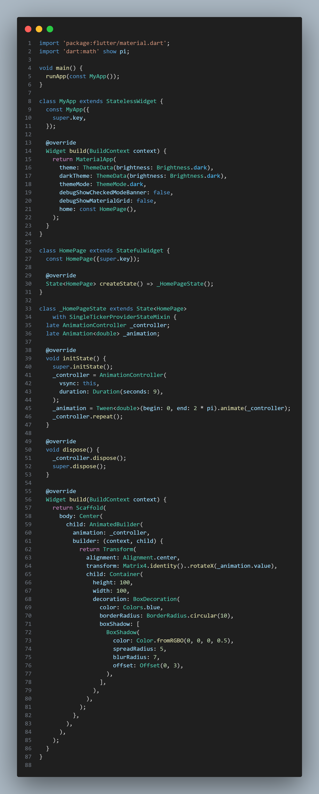
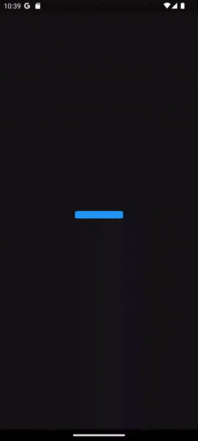

# Animated 3D Flutter Box

This Flutter project demonstrates an animated 3D box that rotates and changes color.

## Features

- **3D Rotation:** The box rotates continuously on its Y-axis.
- **Color Transition:** The box smoothly transitions between a set of predefined colors.
- **Interactive Controls (Optional):** (If applicable, mention any user controls like pause/play, speed adjustment, etc.)
- **Customizable:** (If applicable, mention how users can customize aspects like rotation speed, colors, box size, etc.)

## Matrix Snippet

## Preview
